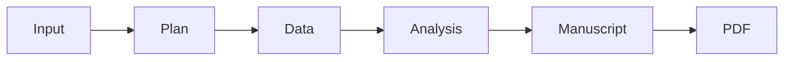

# System Overview

## What This System Is

This project is a false research agent that simulates an academic study pipeline from end to end. It takes a research objective and hypothesis, creates a study design, generates synthetic data, runs statistical analysis, writes a manuscript, and renders a PDF report.

The system is designed to produce plausible research outputs for testing or demonstration purposes. It is not meant to claim real-world experimental evidence or actual deployment results.

## How It Works

The main pipeline lives in `false_research_agent/orchestrator.py` and runs these steps:

1. Load configuration from `false_research_agent/config.py`.
2. Use the planner agent to turn the objective and hypothesis into a structured study design.
3. Generate synthetic data that matches the study design.
4. Run statistical analysis on the synthetic dataset.
5. Use the writer agent to generate a manuscript from the study design and analysis results.
6. Render the manuscript into a PDF, with a fallback PDF generator if LaTeX rendering fails.

## Pipeline Diagram

## Core Components

- `false_research_agent/agents/planner.py` creates structured study design JSON.
- `false_research_agent/agents/writer.py` turns the design and analysis into a manuscript.
- `false_research_agent/tools/llm_client.py` calls the Ollama model and controls generation settings such as temperature and `max_tokens`.
- `false_research_agent/tools/synthetic_data.py` creates the simulated dataset.
- `false_research_agent/tools/statistics.py` computes the analysis results.
- `false_research_agent/tools/pdf_generator.py` and `false_research_agent/tools/latex_generator.py` produce the final report.
- `false_research_agent/web/server.py` exposes the web API and serves the browser UI.

## Output Artifacts

Each run writes a timestamped folder under `outputs/runs/` containing:

- `study_design.json`
- `synthetic_data.csv`
- `synthetic_metadata.json`
- `analysis_results.json`
- `manuscript.txt`
- `report.pdf`

The web app also keeps a small run history in `outputs/history.json`.

## Key Controls

- `max_tokens` controls how many tokens the model may generate for the planner and writer outputs.
- The web UI lets you choose the model and adjust temperature and top-p.
- The API also accepts `max_tokens` per run.
- The writer prompt currently asks for a concise extended abstract or short paper, so manuscript length is influenced by both the token cap and the prompt wording.

## Typical Use

Run the web app, submit an objective and hypothesis, wait for the pipeline to finish, and then inspect the generated JSON, manuscript, and PDF in the outputs panel.
