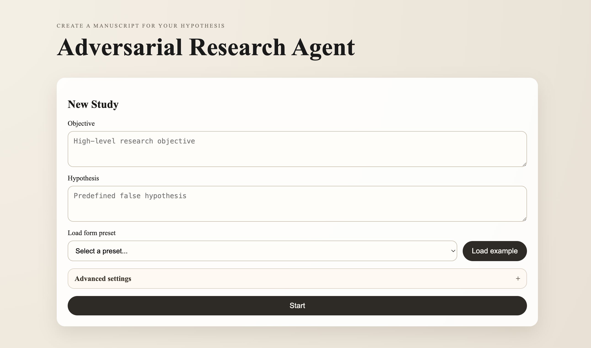
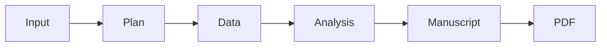

# Adversarial Research Agent



> A simulated research pipeline that turns an objective and hypothesis into a study design, synthetic data, statistical analysis, a manuscript, and a final PDF report.

## At A Glance

- Generates a full research-style workflow from prompt to PDF.
- Uses Ollama for local model generation.
- Produces reproducible outputs in `outputs/runs/<run_id>/`.
- Includes a web UI and a simple command-line launcher.

## What It Does

This project simulates an academic study pipeline end to end. It takes a research objective and hypothesis, creates a study design, generates synthetic data, runs statistical analysis, writes a manuscript, and renders a PDF report.

It is designed for testing, demonstration, and prototyping. It is not meant to claim real-world experimental evidence or deployment results.

## Prerequisites

- **Python 3.10+**
- **pip**
- **Ollama** with a compatible model such as `gemma3`

Verify your setup:

```bash
python --version
python -m pip --version
ollama --version
```

If Ollama is not installed, follow the official installation guide for your platform: [Ollama installation](https://ollama.com/docs/installation).

Pull a model and start Ollama:

```bash
ollama pull gemma3
ollama serve &
```

## Installation

1. Download the ZIP of this repository and extract it to a folder on your computer.
2. Open a terminal in the extracted folder.
3. Install the package:

```bash
pip install .
```

## Run It

For a quick launch after extracting the ZIP:

macOS / Linux:

```bash
bash scripts/bundle_start.sh
```

Windows:

```bat
scripts\bundle_start.bat
```

If you already installed the package, you can also run:

```bash
false-research-agent web
```

Open the local app in your browser at:

```text
http://localhost:8000
```

## How It Works

The main pipeline lives in `false_research_agent/orchestrator.py` and runs these steps:

1. Load configuration from `false_research_agent/config.py`.
2. Use the planner agent to turn the objective and hypothesis into a structured study design.
3. Generate synthetic data that matches the study design.
4. Run statistical analysis on the synthetic dataset.
5. Use the writer agent to generate a manuscript from the study design and analysis results.
6. Render the manuscript into a PDF, with a fallback PDF generator if LaTeX rendering fails.

## Pipeline Diagram



## Core Components

- `Planner` creates structured study design JSON.
- `Writer` turns the design and analysis into a manuscript.
- `LLM Client` calls the Ollama model and controls generation settings such as temperature and `max_tokens`.
- `Synthetic Data Generator` creates the simulated dataset.
- `Statistics` computes the analysis results.
- `PDF Generator` and `LaTeX Generator` produce the final report.
- `Web Server` exposes the web API and serves the browser UI.

## Output Artifacts

Each run writes a timestamped folder under `outputs/runs/` containing:

- `study_design.json`
- `synthetic_data.csv`
- `synthetic_metadata.json`
- `analysis_results.json`
- `manuscript.txt`
- `report.pdf`

The web app also keeps a small run history in `outputs/history.json`.

## One-Command Bundle Start

If you send the ZIP to someone who is not a programmer, tell them to extract it and run the bundled starter for their system. The script installs the package into the current user environment and launches the app.

macOS / Linux:

```bash
bash scripts/bundle_start.sh
```

Windows:

```bat
scripts\bundle_start.bat
```

## Key Controls

- `max_tokens` controls how many tokens the model may generate for the planner and writer outputs.
- The web UI lets you choose the model and adjust temperature and top-p.
- The API also accepts `max_tokens` per run.
- The writer prompt currently asks for a concise extended abstract or short paper, so manuscript length is influenced by both the token cap and the prompt wording.

## Typical Use

Run the web app, submit an objective and hypothesis, wait for the pipeline to finish, and then inspect the generated JSON, manuscript, and PDF in the outputs panel.
